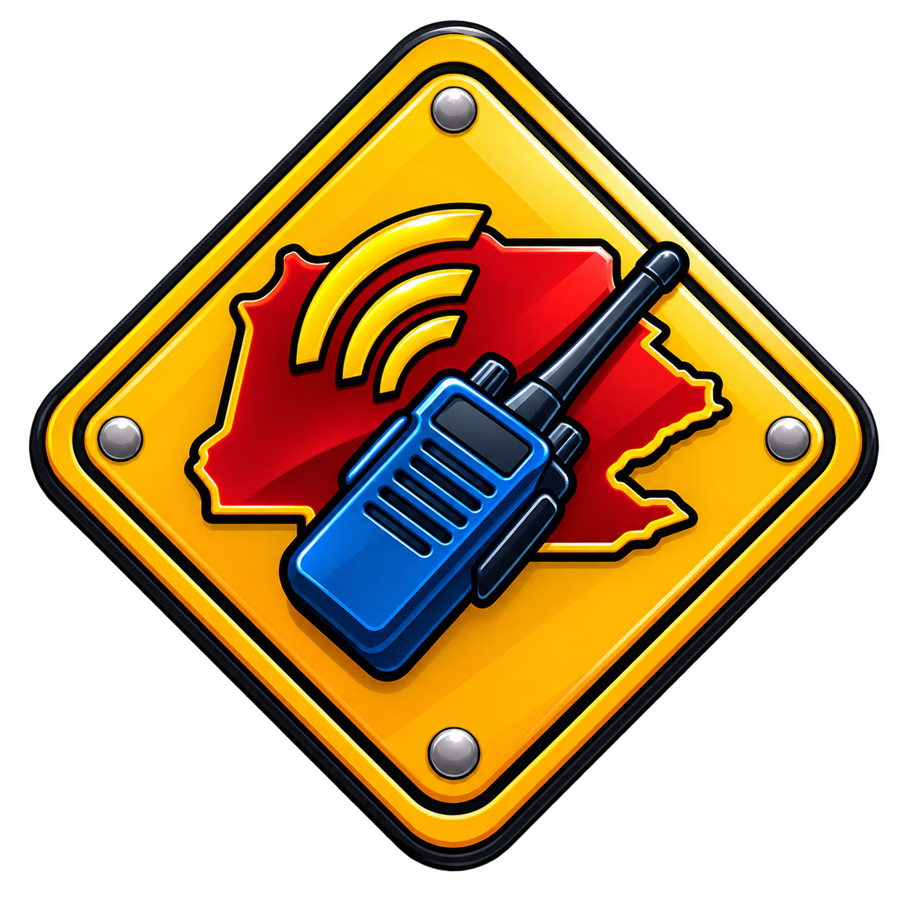

<div align="center">
  

  # AlertPage Working Screen Assist
</div>

A Chrome MV3 extension that reformats AlertPage's Working Screen for faster triage and
links each lead straight through to the matching Data Feed search.

## Features

- **Cleaner lead details** — transcript, source, category, and keywords reordered into a readable block
- **Keyword highlighting** in the transcript
- **Inline audio player** for the transmission link
- **Jurisdiction auto-fill** from City, closing a gap in AlertPage's own address autocomplete
- **Reworked footer buttons** making it intuitive 
- **Monitor button** that fills (or, opt-in, sends) the chat with `/m <county>` in one click
- **Data Feed link** that opens the Data Feed pre-filtered to a lead's system, county, and time window, reusing one tab across leads
- **Summarize (beta)** — drafts a one-line, hyperlinked incident summary from the transmissions around the alert, using your own Gemini API key

## Install

```bash
chrome://extensions → Developer mode → Load unpacked → select the extension/ folder
```

Then open a lead at `https://dispatch.alertpage.net/web/working-queue/<lead id>/`.

The Data Feed link needs you signed in to `ap-portal.alertpage.net` in the same browser.
If you aren't, the link still works — it just opens the Data Feed unfiltered.

## Usage

Open a lead and the layout, highlighting, audio player, and jurisdiction auto-fill are
already applied — nothing to turn on.

- **Monitor** fills the chat with `/m <county>` for you to review and send. Turn on
  "Monitor autosend" in the toolbar popup to have it send instantly instead.
- **Data Feed ↗** opens the Data Feed pre-filtered to that lead's system, county, and
  time window, reusing one tab across leads instead of piling up new ones.
- **Summarize**, in the Data Feed's banner, drafts a one-line incident summary from the
  transmissions around the alert. Click any segment of the result to jump straight to
  the transmission it came from.
- The toolbar icon is the only settings surface: display toggles, Data Feed sync
  toggles, the keyword list, quick-fill pills (set your Agent ID pill once), and your
  Gemini API key for Summarize — everything saves as you type.

Summarize needs your own free-tier Gemini API key, pasted into the "Summarize (AI)"
card. It's stored only in your own browser.

## Network

Three requests, all read-only, none of them automatic beyond the first:

- `GET /get_systems` on `ap-portal.alertpage.net`, to turn a lead's feed name into the
  Data Feed's system id. Cached for 12 hours.
- `GET /get_transmissions` on the same host, only when you click Summarize — fetches
  the transcripts it needs to work from.
- A `generateContent` call to `generativelanguage.googleapis.com` (Google's Gemini
  API), only when you click Summarize, using the API key you supplied. This is the
  one third-party call this extension ever makes, and it's opt-in: leave the key
  blank and it never happens.

## Tests

```bash
node tests/run-tests.js
```
